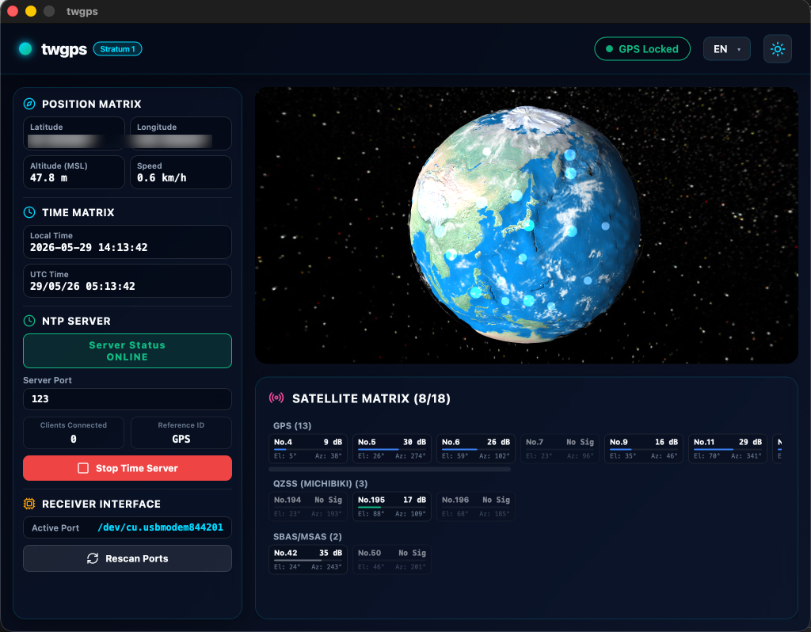
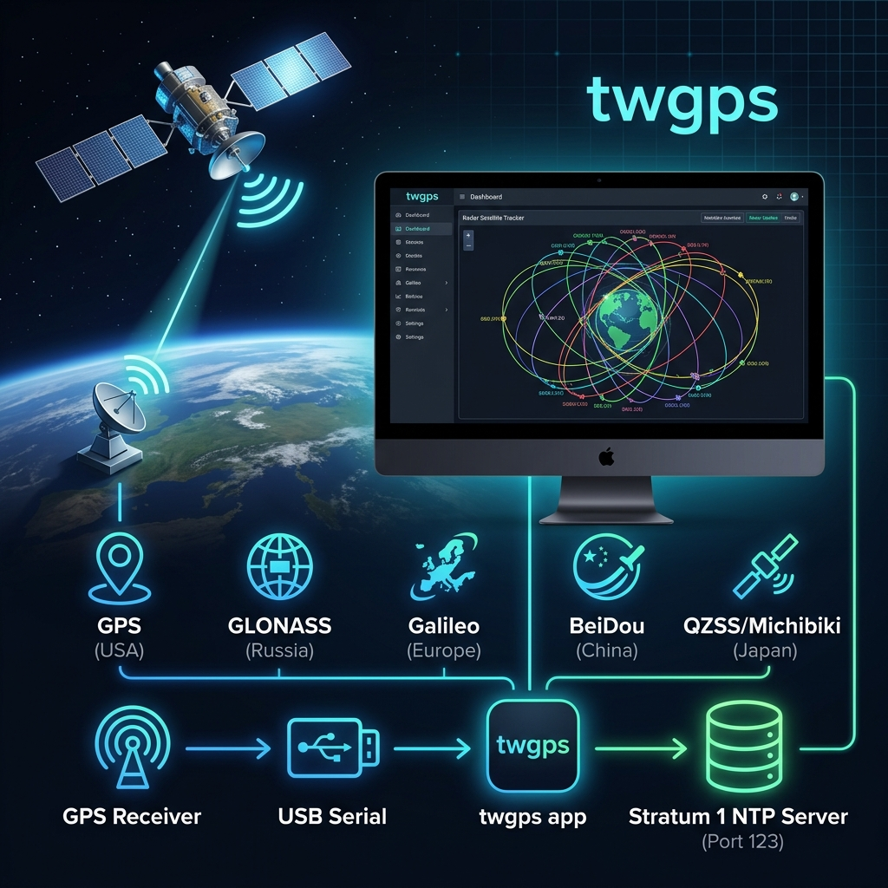

# twgps

[日本語 (Japanese)](README_ja.md)

`twgps` is a lightweight, cross-platform desktop application that turns your computer into a **Stratum 1 NTP server** using a connected USB/Serial GPS receiver. It automatically detects your GPS receiver, visualizes satellite constellations and signal strengths, and serves high-precision NTP time.

Built with [Wails](https://wails.io/) (Go + Svelte).





---

## Required Hardware

To use this software, you need a compatible USB NMEA GPS receiver.

### Verified Hardware:
- **GPS Receiver DOCTORADIO GR7-10HZ** (USB NMEA Receiver)


---

## Features

- **Automatic GPS Receiver Detection**: Automatically scans all serial/USB ports at common baud rates (115200 and 9600 bps) to locate your GPS receiver and start parsing NMEA sentences.
- **Satellite Constellation Visualization**: Tracks and displays active satellites, elevation, azimuth, and Signal-to-Noise Ratio (SNR) for:
  - **GPS** (USA)
  - **GLONASS** (Russia)
  - **Galileo** (EU)
  - **BeiDou** (China)
  - **QZSS / Michibiki** (Japan)
  - **SBAS / MSAS** (Augmentation systems)
- **Built-in Stratum 1 NTP Server**:
  - Serves high-precision time synced with GPS satellite clocks.
  - Defaults to the standard NTP port `123` (or customizable ports).
  - Flags Stratum 1 with the `"GPS "` reference identifier when active.
  - Automatically falls back to system time if the GPS receiver loses its 3D fix.
- **Modern User Interface**: A responsive dashboard with real-time updates and multi-language support (English and Japanese).

---

## Installation

You can download pre-built binaries from the GitHub Releases page.

- **Windows**: Download the `.zip` archive, extract it, and run `twgps.exe`.
- **Linux**: Download the `.tar.gz` archive, extract it, and run the binary. See [Linux Setup](#linux-setup) below for important permission and graphics settings.
- **macOS**: Download the `.app` or disk image and copy it to your Applications folder.

---

## Operation Guide

1. **Connect your GPS Receiver**: Plug your USB or serial NMEA-compatible GPS receiver into your computer.
2. **Start twgps**: Launch the application.
3. **Auto-Scan**: `twgps` will scan your serial ports in the background. Once a valid NMEA stream is detected, the status changes to green, and satellite details will begin updating.
4. **Acquire Fix**: Wait for the GPS receiver to obtain a 3D fix. The dashboard will display your latitude, longitude, altitude, and current UTC time.
5. **Start the NTP Server**:
   - Enter the desired port (default is `123`).
   - Click the **Start NTP** button.
   - *Note*: Using port `123` on Linux or macOS requires elevated capabilities or root privileges for binding. See [Linux Setup](#linux-setup) below.

---

## Linux Setup

### 1. Serial Port Permissions (Permission Denied)
To access USB serial adapters (e.g., `/dev/ttyACM0` or `/dev/ttyUSB0`) without root access, you must add your user to the appropriate dialout group:

- **Ubuntu / Debian / Fedora**:
  ```bash
  sudo usermod -a -G dialout $USER
  ```
- **Arch Linux**:
  ```bash
  sudo usermod -a -G uucp $USER
  ```

> [!IMPORTANT]
> You must **log out and log back in** (or restart your system) for the group changes to take effect.

#### Why you shouldn't use `sudo` to run `twgps`
If you attempt to run `twgps` with `sudo` (e.g., `sudo ./twgps`), it will fail to start and crash with `panic: failed to init GTK`. This happens because GUI applications running as root cannot connect to your user's desktop display server (X11 or Wayland). Always grant your user serial port permissions instead.

### 2. Standard NTP Port 123 Binding
Binding to privileged ports (< 1024) like UDP `123` is restricted to root on Linux. Instead of running the entire app with `sudo`, grant the binary net-bind privileges:

```bash
sudo setcap 'cap_net_bind_service=+ep' ./twgps
```

### 3. Blank Screen / Rendering Issues on Older GPUs
If you experience a blank (white) window or crashes on launch, WebKit2GTK may be struggling with your graphics driver. You can bypass this by setting environment variables to disable hardware compositing or DMABUF rendering:

```bash
# Disable DMABUF rendering (Recommended for older GPUs/Intel/Mesa)
WEBKIT_DISABLE_DMABUF_RENDERER=1 ./twgps

# Disable hardware acceleration entirely if issues persist
WEBKIT_DISABLE_COMPOSITING_MODE=1 ./twgps
```

---

## Local Build Instructions

### Prerequisites
To build `twgps` from source, ensure you have the following installed:
- **Go**: Version 1.26 or higher
- **Node.js**: Version 20 or higher
- **Wails CLI**: Version 2
  ```bash
  go install github.com/wailsapp/wails/v2/cmd/wails@latest
  ```
- **Mise** (Optional task runner)

### Build Steps

1. **Clone the repository**:
   ```bash
   git clone https://github.com/twsnmp/twgps.git
   cd twgps
   ```

2. **Development Mode**:
   Launch the app in live-rebuilding development mode:
   ```bash
   wails dev
   # Or using mise:
   mise run dev
   ```

3. **Production Build**:
   Compile the production bundle for your current OS:
   ```bash
   wails build
   # Or using mise:
   mise run build
   ```

---

## License

This project is licensed under the Apache License, Version 2.0. See the [LICENSE](LICENSE) file for details.
